# **About Dashlets**

In Agile CRM, dashboard plays a very vital role. Dashboards are where users track all relevant information. Dashboards consist of small information components called dashlets. Dashboard can have multiple dashlets each showing relevant snapshot information. A dashlet is a summary component that shows snapshot of information like contacts list, pending deals, events, leaderboard and so on. A dashlet may or may not have an equivalent page component. If there is an equivalent page component, the related dashlet displays the information generated from it. Dashlets can be added to user dashboard and also specific pages like contacts, deals and so on. 

Dashlets are categorized into the following categories:
1. Contacts
2. Deals
3. Calendar
4. Activity
5. RSS Feed
6. Account Info

Let’s look at each of the dashlet categories.
##### **Contacts Dashlets**
Contact dashlets show information about contacts. Contact dashlets include contacts list, emails open and tag graph.

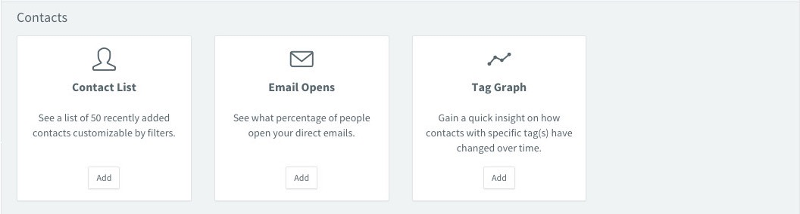

##### **Contact List**
Contact List dashlet shows a list of 50 recently added contacts customizable by filters. Contact List dashlet can be added to user dashboards or other pages like contacts, deals and so on.

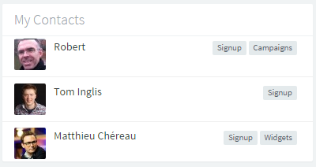

###### **Setup:**
1. Click on “Add Dashlet” button
2. Select and Add “Contact List” dashlet under Contacts category
3. Select the pages where the dashlet needs to be shown

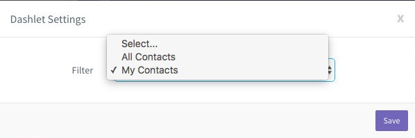

###### **Settings:**
1. Settings include filter 
2. Click the settings icon on dashlet
3. In filter dropdown, user can select from all contacts or my contacts
4. Save the selected setting

##### **Email Opens:**
Email Opens dashlet shows what percentage of users open your direct emails. Email Opens dashlet can be added to user dashboards or other pages like contacts, deals and so on.

Email opens dashlet shows the number and percentage of opened emails among the sent emails. More information on opened emails is also shown. All the information is shown for the selected time duration.

This dashlet has options to print and download. Download options include download as PNG, JPEG, SVG Vector, PDF, CSV, XLS.

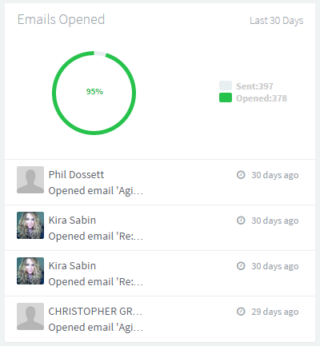

###### **Setup:**
1. Click on “Add Dashlet” button
2. Select and Add “Email Opens” dashlet under Contacts category
3. Select the pages where the dashlet needs to be shown

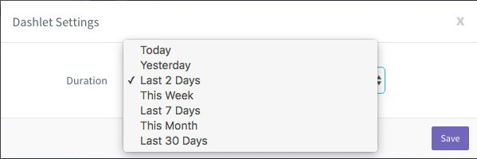

###### **Settings:**
1. Settings include duration
2. Click the settings icon on dashlet
3. In duration dropdown, user can select from today, yesterday, last 2 days, this week, last 7 days, this month, last 30 days
4. Save the selected setting

##### **Tag Graph:**
Tag Graph dashlet shows quick insight into how contacts with specific tag(s) have changed over time. Tag Graph dashlet can be added to user dashboards or other pages like contacts, deals and so on.

Tag graph dashlet shows how the selected tags are changed over selected time period.

This dashlet has options to print and download. Download options include download as PNG, JPEG, SVG Vector, PDF, CSV, XLS.

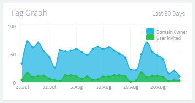

###### **Setup:**
1. Click on “Add Dashlet” button
2. Select and Add “Tag Graph” dashlet under Contacts category
3. Select the pages where the dashlet needs to be shown

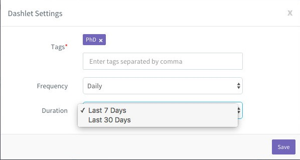

###### **Settings:**
1. Settings include tags, frequency and duration 
2. Click the settings icon on dashlet
3. In tags settings, user can select from the available tags
4. In frequency dropdown, user can select from daily, weekly, monthly
5. In duration dropdown, user can select from last 7 days or last 30 days
6. Save the selected setting

##### **Deals Dashlets:**
Deal dashlets show information about deals. Deal dashlets include pending deals, deals by milestone, deals funnel, revenue graph, deal goals, incoming deals and lost deal analysis.

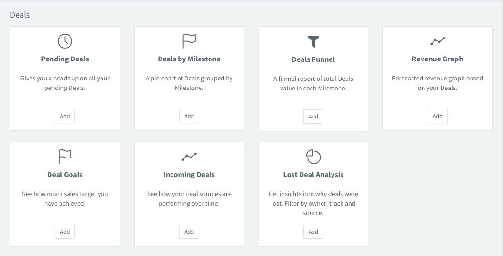

##### **Pending Deals:**
Pending Deals dashlet gives users a heads up on all the pending deals. Pending Deals dashlet can be added to user dashboards or other pages like contacts, deals and so on.

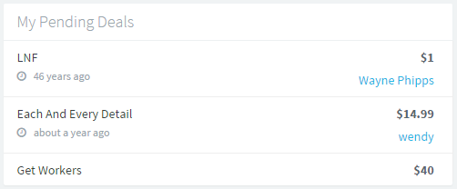

###### **Setup:**
1. Click on “Add Dashlet” button
2. Select and Add “Pending Deals” dashlet under Deals category
3. Select the pages where the dashlet needs to be shown

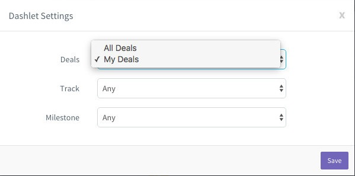

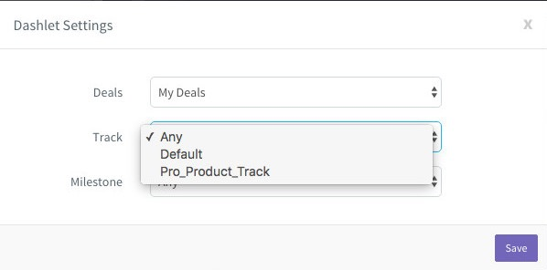

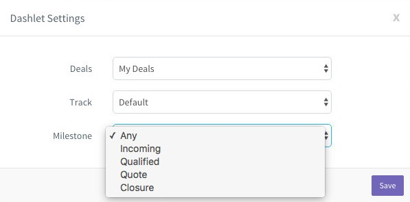

###### **Settings:**
1. Settings include deals, track and milestone 
2. Click the settings icon on dashlet
3. In deals dropdown, user can select from all deals or my deals
4. In track dropdown, user can select from the available deal tracks
5. In milestone dropdown, user can select from the available milestones of selected track
6. Save the selected setting

##### **Deals by Milestone:**
Deals by Milestone dashlet shows a pie-chart of deals grouped by milestone. Deals by Milestone dashlet can be added to user dashboards or other pages like contacts, deals and so on.

Deals by milestone dashlet shows the percentage of deals in each of the milestones of the selected track.

This dashlet has options to print and download. Download options include download as PNG, JPEG, SVG Vector, PDF, CSV, XLS.

###### **Setup:**
1. Click on “Add Dashlet” button
2. Select and Add “Deals by Milestone” dashlet under Deals category
3. Select the pages where the dashlet needs to be shown

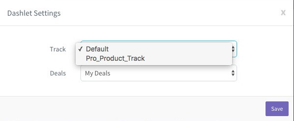

###### **Settings:**
1. Settings include deals, track and milestone 
2. Click the settings icon on dashlet
3. In deals dropdown, user can select from all deals or my deals
4. In track dropdown, user can select from the available deal tracks
5. In milestone dropdown, user can select from the available milestones of selected track
6. Save the selected setting

##### **Deals Funnel:**
Deals Funnel dashlet shows a funnel report of total deals value in each milestone. Deals Funnel dashlet can be added to user dashboards or other pages like contacts, deals and so on.

Deals funnel dashlet shows the number and value of deals against each of the deal milestones.

This dashlet has options to print and download. Download options include download as PNG, JPEG, SVG Vector, PDF, CSV, XLS.

###### **Setup:**
1. Click on “Add Dashlet” button
2. Select and Add “Deals Funnel” dashlet under Deals category
3. Select the pages where the dashlet needs to be shown

 
 
 
  
  
 
 ###### **Settings:**
1. Settings include track, deals and split by
2. Click the settings icon on dashlet
3. In track dropdown, user can select from available deal tracks
4. In deals dropdown, user can select from all deals or my deals
5. In split by dropdown, user can select from revenue or count
6. Save the selected setting

 ##### **Revenue Graph:**
Revenue Graph dashlet shows forecasted revenue graph based on user's deals. Revenue Graph dashlet can be added to user dashboards or other pages like contacts, deals and so on.

Revenue graph dashlet shows the information on total revenue and pipeline revenue. All the information is shown for the selected time duration.

This dashlet has options to print and download. Download options include download as PNG, JPEG, SVG Vector, PDF, CSV, XLS.

 

###### **Setup:**
1. Click on “Add Dashlet” button
2. Select and Add “Revenue Graph” dashlet under Deals category
3. Select the pages where the dashlet needs to be shown

###### **Settings:**
1. Settings include duration and track
2. Click the settings icon on dashlet
3. In duration dropdown, user can select from last quarter, this quarter, next quarter, this and next quarter, this year, next year
4. In track settings, user can select from the available deal tracks
5. Save the selected setting

##### **Deal Goals:**
Deal Goals dashlet shows how much sales target has been achieved. Deal Goals dashlet can be added to user dashboards or other pages like contacts, deals and so on.

Deal goals dashlet shows the information on number and percentage of deals won against target along with number and percentage of revenue generated against target. All the information is shown for the selected time duration.

###### **Setup:**
1. Click on “Add Dashlet” button
2. Select and Add “Deal Goals” dashlet under Deals category
3. Select the pages where the dashlet needs to be shown

###### **Settings:**
1. Settings include duration
2. Click the settings icon on dashlet
3. In duration dropdown, user can select from this month, last month, this quarter, this year
4. Save the selected setting

##### **Incoming Deals:**
Incoming Deals dashlet shows how deal sources are performing over time. Incoming Deals dashlet can be added to user dashboards or other pages like contacts, deals and so on.

Incoming deals dashlet shows information on number of incoming deals split by deal source. All the information is shown for the selected time duration.

This dashlet has options to print and download. Download options include download as PNG, JPEG, SVG Vector, PDF, CSV, XLS.

###### **Setup:**
1. Click on “Add Dashlet” button
2. Select and Add “Incoming Deals” dashlet under Deals category
3. Select the pages where the dashlet needs to be shown

###### **Settings:**
1. Settings include split by, owner, frequency and duration
2. Click the settings icon on dashlet
3. In split by dropdown, user can select from total deals or total revenue
4. In owner dropdown, user can select from all or any of the available owners
5. In frequency dropdown, user can select from daily, weekly, monthly
6. In duration dropdown, user can select from today, yesterday, last 7 days, last 30 days, this month, last month, this quarter, last quarter, this year, last year
7. Save the selected setting

##### **Lost Deal Analysis:**
Lost Deal Analysis dashlet shows insights into why deals were lost. This is filterable by owner, track and source. Lost Deal Analysis dashlet can be added to user dashboards or other pages like contacts, deals and so on.

Lost deal analysis dashlet shows the percentage of deals lost because of the selected loss reasons. All the information is shown for the selected time duration.

This dashlet has options to print and download. Download options include download as PNG, JPEG, SVG Vector, PDF, CSV, XLS.

###### **Setup:**
1. Click on “Add Dashlet” button
2. Select and Add “Lost Deal Analysis” dashlet under Deals category
3. Select the pages where the dashlet needs to be shown

###### **Settings:**
1. Settings include owner, track, source and duration
2. Click the settings icon on dashlet
3. In owner dropdown, user can select from all or any of the available owner
4. In track dropdown, user can select from all or any of the available tracks
5. In source dropdown, user can select from all or any of hte available sources
6. In duration dropdown, user can select from today, yesterday, last 7 days, last 30 days, this month, last month, this quarter, last quarter, this year, last year
7. Save the selected setting

##### **Calendar Dashlets:**
Calendar dashlets show information about events and tasks. Calendar dashlets include events, tasks, task report, mini calendar and task completion time deviation.

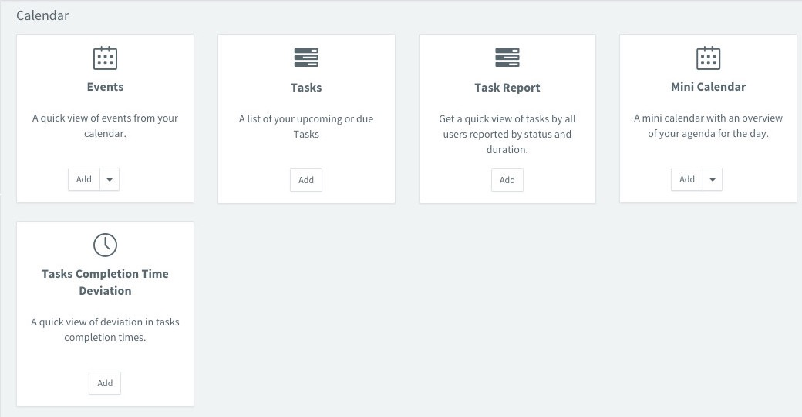

##### **Events:**
Events dashlet shows a quick view of events from user’s calendar. Events dashlet can be added to user dashboards or other pages like contacts, deals and so on.

Events dashlet shows the events and their details for the selected time duration.

###### **Setup:**
1. Click on “Add Dashlet” button
2. Select and Add “Events” dashlet under Calendar category
3. Select the pages where the dashlet needs to be shown

###### **Settings:**
1. Settings include duration
2. Click the settings icon on dashlet
3. In duration dropdown, user can select from next 7 days, this week, today and tomorrow, today
4. Save the selected setting

##### **Tasks:**
Tasks dashlet shows a list of upcoming or due tasks. Tasks dashlet can be added to user dashboards or other pages like contacts, deals and so on.

Tasks dashlet shows the tasks and their details for the selected time duration.

###### **Setup:**
1. Click on “Add Dashlet” button
2. Select and Add “Tasks” dashlet under Calendar category
3. Select the pages where the dashlet needs to be shown

###### **Settings:**
1. Settings include duration
2. Click the settings icon on dashlet
3. In duration dropdown, user can select from next 7 days, this week, today and tomorrow, today, all over due
4. Save the selected setting

##### **Task Report:**
Task Report dashlet shows a quick view of tasks by all users reported by status and duration. Task Report dashlet can be added to user dashboards or other pages like contacts, deals and so on.

Task reports shows the information on number of tasks split by task category for each of the selected users. All the information is shown for the selected time duration.

This dashlet has options to print and download. Download options include download as PNG, JPEG, SVG Vector, PDF, CSV, XLS.

###### **Setup:**
1. Click on “Add Dashlet” button
2. Select and Add “Task Report” dashlet under Calendar category
3. Select the pages where the dashlet needs to be shown

###### **Settings:**
1. Settings include report by, tasks, split by, duration and user
2. Click the settings icon on dashlet
3. In report by dropdown, user can select from user, category and status
4. In tasks dropdown, user can select from all tasks or completed tasks
5. In split by dropdown, user can select from category or status
6. In duration dropdown, user can select from today, yesterday, this week, last 7 days, this month, last 30 days
7. In user settings, user can select from the available users
8. Save the selected setting

##### **Mini Calendar:**
Mini Calendar dashlet shows an overview of user’s agenda for the day. Mini Calendar dashlet can be added to user dashboards or other pages like contacts, deals and so on.

###### **Setup:**
1. Click on “Add Dashlet” button
2. Select and Add “Mini Calendar” dashlet under Calendar category
3. Select the pages where the dashlet needs to be shown

##### **Tasks Completion Time Deviation:**
Tasks Completion Time Deviation dashlet shows a quick view of deviation in tasks completion times. Tasks Completion Time Deviation dashlet can be added to user dashboards or other pages like contacts, deals and so on.

Tasks completion time deviation dashlet shows the information of number of tasks and time deviation for completion. Each of the task categories are shown in separate color. The information will be shown for the selected users and selected time duration.

This dashlet has options to print and download. Download options include download as PNG, JPEG, SVG Vector, PDF, CSV, XLS.

###### **Setup:**
1. Click on “Add Dashlet” button
2. Select and Add “Tasks Completion Time Deviation” dashlet under Calendar category
3. Select the pages where the dashlet needs to be shown

###### **Settings:**
1. Setting include duration
2. Click the settings icon on dashlet
3. In duration dropdown, user can select from today, yesterday, this week, last 7 days, this month, last 30 days
4. Save the selected setting

 ##### **Activity Dashlets:**
Activity dashlets show information about activities performed by users. Activity dashlets include activity overview, leaderboard, calls, user activities and campaign stats.

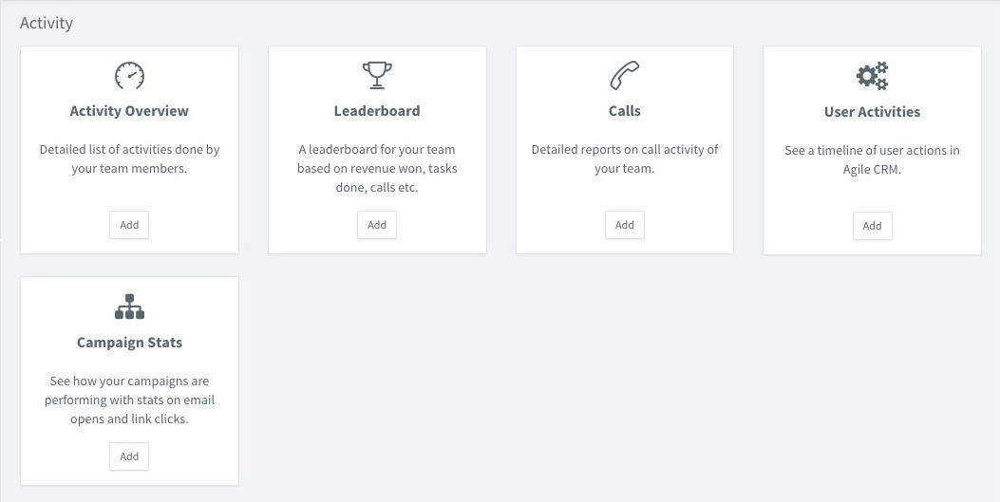

 ##### **Activity Overview:**
Activity Overview dashlet shows detailed list of activities done by the team members. Activity Overview dashlet can be added to user dashboards or other pages like contacts, deals and so on.

Activity overview dashlet shows information like number of new contacts, value and number of deals won, number of campaign emails sent and value and number of new deals. All the information is shown for the selected time duration.

###### **Setup:**
1. Click on “Add Dashlet” button
2. Select and Add “Activity Overview” dashlet under Activity category
3. Select the pages where the dashlet needs to be shown

###### **Settings:**
1. Setting include duration
2. Click the settings icon on dashlet
3. In duration dropdown, user can select from today, yesterday, last 24 hours, this week, last week, last 7 days, this month, last month, last 30 days
4. Save the selected setting.

##### **Leaderboard:**
Leaderboard dashlet shows leaderboard for the team based on revenue won, tasks done, calls and so on. Leaderboard dashlet can be added to user dashboards or other pages like contacts, deals and so on.

Leaderboard shows the revenue generated, deals won, calls done and tasks done by the selected users. Leaderboard can be used to show the ranking of users against others. All the information is shown for the selected time duration.

###### **Setup:**
1. Click on “Add Dashlet” button
2. Select and Add “Leaderboard” dashlet under Activity category
3. Select the pages where the dashlet needs to be shown

###### **Settings:**
1. Setting include board, user and duration
2. Click the settings icon on dashlet
3. In board settings, user can select all or any of available options like revenue, deals won, calls, tasks and so on
4. In user settings, user can select from the available users
5. In duration dropdown, user can select from this quarter, last quarter, this month, last month, this week, last week
6. Save the selected setting

##### **Calls:**
Calls dashlet shows detailed reports on call activity of the team. Calls dashlet can be added to user dashboards or other pages like contacts, deals and so on.

Calls dashlet shows information on number of calls answered, number of calls reported as busy, number of failed calls and number of calls that went to voicemails for the selected users. All the information is shown for the selected time duration.

This dashlet has options to print and download. Download options include download as PNG, JPEG, SVG Vector, PDF, CSV, XLS.

###### **Setup:**
1. Click on “Add Dashlet” button
2. Select and Add “Calls” dashlet under Activity category
3. Select the pages where the dashlet needs to be shown.

###### **Settings:**
1. Setting include duration, graph on and user
2. Click the settings icon on dashlet
3. In duration dropdown, user can select from today, yesterday, this week, last 7 days, this month, last 30 days
4. In graph on dropdown, user can select from no. of calls or call duration
5. In user settings, user can select from the available users
6. Save the selected setting

##### **User Activities:**
User Activities dashlet shows a timeline of user actions in Agile CRM. User Activities dashlet can be added to user dashboards or other pages like contacts, deals and so on.

###### **Setup:**
1. Click on “Add Dashlet” button
2. Select and Add “User Activities” dashlet under Activity category
3. Select the pages where the dashlet needs to be shown

##### **Campaign Stats:**
Campaign Stats dashlet shows how campaigns are performing with stats on email opens and link clicks. Campaign Stats dashlet can be added to user dashboards or other pages like contacts, deals and so on.

Campaign stats dashlet shows information on number of emails sent, number of emails opened, number of links clicked, number of users unsubscribed. All the information is shown for the selected time duration.

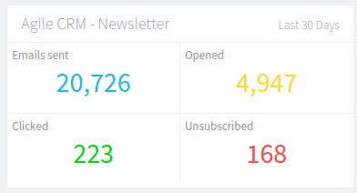

###### **Setup:**
1. Click on “Add Dashlet” button
2. Select and Add “Campaign Stats” dashlet under Activity category
3. Select the pages where the dashlet needs to be shown

###### **Settings:**
1. Setting include duration and campaign type
2. Click the settings icon on dashlet
3. In duration dropdown, user can select from today, yesterday, last 24 hours, this week, last week, last 7 days, this month, last month, last 30 days
4. In campaign type dropdown, user can select from all campaigns or any of the available campaigns
5. Save the selected setting

##### **RSS Feed Dashlets:**
RSS feed dashlets show information from various feed providers like Agile CRM blog. RSS feed dashlets include Agile CRM Blog.

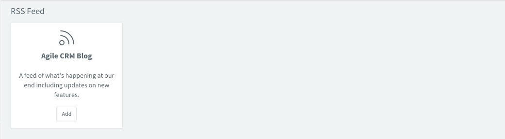

##### **Agile CRM Blog:**
Agile CRM Blog dashlet shows a feed of what’s happening at Agile CRM’s end including updates on new features. Agile CRM Blog dashlet can be added to user dashboards or other pages like contacts, deals and so on.

###### **Setup:**
1. Click on “Add Dashlet” button
2. Select and Add “Agile CRM Blog” dashlet under RSS Feed category
3. Select the pages where the dashlet needs to be shown

##### **Account Info Dashlets:**
Account Info dashlets show information about user’s account. Account Info dashlets include Account Details.

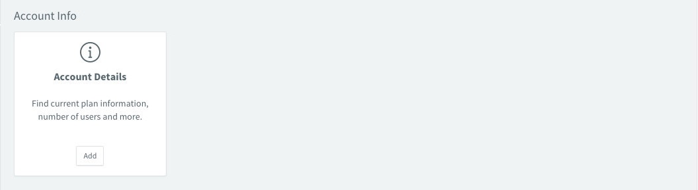

##### **Account Details:**
Account Details dashlet shows current plan information, number of users and more. Account Details dashlet can be added to user dashboards or other pages like contacts, deals and so on.

Account details dashlet shows information on plan (Free, Starter, Regular or Enterprise) along with number of users. It also shows account representative details along with option to schedule a call.

###### **Setup:**
1. Click on “Add Dashlet” button
2. Select and Add “Account Details” dashlet under Account Info category
3. Select the pages where the dashlet needs to be shown

